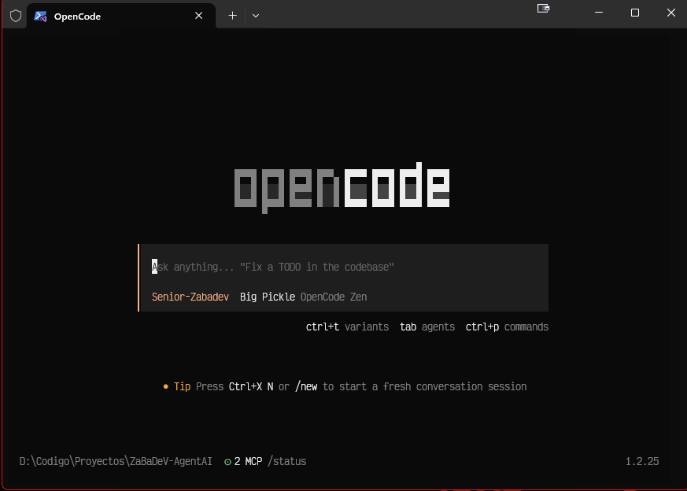

# ZaBaDeV-AgentAI

<div align="center">

<pre>
██████╗
╚══███╔╝
  ███╔╝
 ███╔╝
██████╗
╚══════╝
</pre>

<h1>Senior ZaBaDeV — AI Agent Ecosystem</h1>

<p><strong>One command. OpenCode fully configured with the complete ZaBaDeV ecosystem.</strong></p>

<p>
<a href="https://github.com/zabadev/agent-ai/releases"></a>
<a href="LICENSE"></a>


<a href="https://github.com/zabadev/agent-ai/actions"></a>
</p>

</div>

---

## Screenshot



---

## What is ZaBaDeV?

**Senior ZaBaDeV** is an AI development ecosystem that transforms your AI editor/agent into a professional development assistant with:

- **Persistent Memory (Engram)** — Remembers decisions, bugs, and conventions across sessions
- **SDD Workflow** — Spec-Driven Development: plan before you code
- **Professional Skills** — Coding patterns for React, TypeScript, Tailwind, testing, and more
- **MCP Servers** — Context7 for up-to-date documentation
- **Teaching-First Persona** — An architectural mentor that explains the "why" before the "what"
- **Automated Review with GGA** — Guardian Angel reviews every commit

---

## Key Features

| Feature | Description |
|---------|-------------|
| **One-Click Setup** | Single command installs the complete ecosystem |
| **Cross-Platform** | Works on macOS, Linux, and Windows |
| **Multi-Agent Support** | OpenCode, Claude Code, Cursor, Gemini CLI, VSCode |
| **Persistent Learning** | Remembers your preferences and project patterns |
| **Spec-Driven Development** | Structured planning and implementation workflow |
| **Automated Code Review** | GGA checks code quality on every commit |
| **Context7 Integration** | Real-time documentation and examples |
| **Extensible Skills** | Modular skills system for custom workflows |

---

## Quick Start

### Prerequisites

- Go 1.21 or later
- Git
- One of: OpenCode, Claude Code, Cursor, Gemini CLI, or VSCode

### Installation

```bash
# Clone the repository
git clone https://github.com/zabadev/agent-ai.git
cd agent-ai

# Build and install
make build
make install

# Or install directly
go install github.com/zabadev/agent-ai/cmd/gentle-ai@latest
```

### Setup

```bash
# Initialize ZaBaDeV ecosystem
gentle-ai install

# For development with hot reload
make dev
make run-dev
```

---

## Usage

### Basic Commands

```bash
# Install agents and tools
gentle-ai install

# Sync configurations
gentle-ai sync

# Update tools
gentle-ai upgrade

# Restore from backup
gentle-ai restore --list
gentle-ai restore <backup-id>

# Show version
gentle-ai version
```

### SDD Workflow

```bash
# Initialize project
gentle-ai sdd-init

# Explore feature
gentle-ai sdd-explore "add user authentication"

# Create change proposal
gentle-ai sdd-new "implement-user-auth"

# Write specifications
gentle-ai sdd-spec

# Design implementation
gentle-ai sdd-design

# Plan tasks
gentle-ai sdd-tasks

# Implement
gentle-ai sdd-apply

# Verify
gentle-ai sdd-verify

# Archive
gentle-ai sdd-archive
```

---

## Architecture

```
ZaBaDeV-AgentAI/
├── cmd/gentle-ai/          # Main CLI application
├── internal/
│   ├── agents/            # Agent-specific implementations
│   ├── app/               # Core application logic
│   ├── assets/            # Embedded assets and templates
│   ├── backup/            # Backup and restore functionality
│   ├── cli/               # CLI commands and execution
│   ├── components/        # UI components and rendering
│   ├── model/             # Data models and types
│   └── system/            # System detection and utilities
├── pkg/                   # Public packages
└── testdata/              # Test fixtures and golden files
```

---

## Development

### Building

```bash
# Build for current platform
make build

# Build for all platforms
make build-all

# Run tests
make test

# Run tests with coverage
make test-coverage

# Lint code
make lint

# Clean build artifacts
make clean
```

### Testing

```bash
# Run all tests
go test ./...

# Run tests with verbose output
go test ./... -v

# Run tests with race detection
go test ./... -race

# Run specific package tests
go test ./internal/app -v
```

### Contributing

1. Fork the repository
2. Create a feature branch: `git checkout -b feature/amazing-feature`
3. Write tests for your changes
4. Ensure CI passes: `make ci`
5. Submit a pull request

---

## Configuration

### Agent Configuration

ZaBaDeV supports multiple AI agents:

- **OpenCode** — Primary development environment
- **Claude Code** — Anthropic's coding assistant
- **Cursor** — AI-first code editor
- **Gemini CLI** — Google's AI assistant
- **VSCode** — With GitHub Copilot

### Skills System

Extend functionality with skills:

```bash
# List available skills
gentle-ai sync --skills

# Install specific skills
gentle-ai sync --skills react,typescript,testing
```

### Backup & Restore

```bash
# Create backup
gentle-ai install  # Creates automatic backup

# List available backups
gentle-ai restore --list

# Restore specific backup
gentle-ai restore backup-2024-01-15-14-30-00
```

---

## Documentation

- [Architecture Overview](docs/architecture.md)
- [SDD Workflow Guide](docs/sdd-workflow.md)
- [Agent Configuration](docs/agent-config.md)
- [Skills Development](docs/skills.md)
- [Troubleshooting](docs/troubleshooting.md)

---

## License

This project is licensed under the MIT License - see the [LICENSE](LICENSE) file for details.

---

## Support

- **Issues**: [GitHub Issues](https://github.com/zabadev/agent-ai/issues)
- **Discussions**: [GitHub Discussions](https://github.com/zabadev/agent-ai/discussions)
- **Documentation**: [docs/](docs/)

---

<div align="center">

**Built with ❤️ for the AI development community**

[⭐ Star us on GitHub](https://github.com/zabadev/agent-ai) • [📖 Read the docs](docs/) • [🐛 Report bugs](https://github.com/zabadev/agent-ai/issues)

</div>
|----------------|-------------|
| **Engram** | Sistema de memoria persistente que survive entre sesiones |
| **SDD Workflow** | 9 skills para Spec-Driven Development: init, explore, propose, spec, design, tasks, apply, verify, archive |
| **Skills** | 11+ skills profesionales para desarrollo moderno |
| **MCP Servers** | Context7, Notion, Jira para integracion de documentacion y proyectos |
| **GGA** | Guardian Angel — revision de codigo AI en cada commit |
| **Persona ZaBaDeV** | Modo mentor arquitectonico con estilo teaching-first |
| **Multi-plataforma** | macOS, Linux, Windows (WSL) |

---

## Instalacion

### macOS / Linux

```bash
curl -fsSL https://raw.githubusercontent.com/zabadev/agent-ai/main/scripts/install.sh | bash
```

### Windows (PowerShell)

```powershell
irm https://raw.githubusercontent.com/zabadev/agent-ai/main/scripts/install.ps1 | iex
```

### Homebrew (macOS / Linux)

```bash
brew tap zabadev/homebrew-tap
brew install zabadev
```

### Go install (cualquier plataforma con Go 1.24+)

```bash
go install github.com/zabadev/agent-ai/cmd/zabadev@latest
```

### Desde Releases

Descarga el binario para tu plataforma desde [GitHub Releases](https://github.com/zabadev/agent-ai/releases).

---

## Uso

```bash
# Instalacion estandar en OpenCode (comportamiento por defecto)
zabadev

# Mostrar ayuda
zabadev --help

# Mostrar version
zabadev version
```

---

## Que se Instala

Cuando ejecutas `zabadev`, se instala en tu agente de IA:

| Componente | Descripcion |
|------------|-------------|
| **Engram** | Sistema de memoria persistente |
| **SDD Workflow** | Spec-Driven Development completo |
| **Skills** | 11+ skills profesionales |
| **Context7** | Servidor MCP para documentacion |
| **GGA** | Automatizacion de agente global |
| **Permisos** | Configuracion security-first |
| **Persona** | Senior ZaBaDeV modo ensenanza |

---

## Estructura del Proyecto

```
cmd/zabadev/             # Punto de entrada CLI
internal/
  app/                   # Dispatch de comandos + wiring
  model/                 # Tipos de dominio
  catalog/               # Definiciones de registro
  system/                # Deteccion OS/distro
  cli/                   # Flags de instalacion
  pipeline/              # Ejecucion por etapas
  backup/                # Snapshot de config
  components/            # Logica por componente
    engram/  sdd/  skills/  mcp/  persona/
  agents/                # Adaptadores de agente
    claude/  opencode/  gemini/  cursor/
  verify/                # Health checks
  tui/                   # Interfaz Bubbletea
scripts/                 # Scripts de instalacion
e2e/                     # Tests E2E en Docker
testdata/                # Fixtures golden
```

---

## Testing

```bash
# Tests unitarios
go test ./...

# Docker E2E (Ubuntu + Arch + Fedora, requiere Docker)
RUN_FULL_E2E=1 RUN_BACKUP_TESTS=1 ./e2e/docker-test.sh
```

---

## Documentacion Adicional

- [Arquitectura](docs/architecture.md) — Detalles tecnicos del proyecto
- [Usage](docs/usage.md) — Guia de uso avanzada
- [Non-Interactive](docs/non-interactive.md) — Modo no interactivo para CI
- [Quickstart](docs/quickstart.md) — Guia de inicio rapido
- [Platforms](docs/platforms.md) — Notas especificas por plataforma

---

## Relación con Gentleman.Dots

| | Gentleman.Dots | ZaBaDeV |
|--|---------------|---------|
| **Proposito** | Entorno de desarrollo (editores, shells, terminales) | Capa de desarrollo IA (agentes, memoria, skills) |
| **Instala** | Neovim, Fish/Zsh, Tmux/Zellij, Ghostty | Configura Claude Code, OpenCode, Gemini CLI, Cursor |
| **Superposicion** | Ninguna — complementario | Ninguna — diferente capa |

Instala Gentleman.Dots primero para tu entorno de desarrollo, luego ZaBaDeV para la capa de IA.

---

## Licencia

MIT License — consulta el archivo [LICENSE](LICENSE) para mas detalles.

---

## Agradecimientos

<div align="center">

**Dedicado a Gentleman, el creador original del ecosistema ZaBaDeV.**

</div>

Este proyecto esta inspirado en el trabajo visionario de **Gentleman Programming**, quien creo el concepto de un ecosistema de desarrollo de IA completo y profesional. Su contribucion al ecosistema de desarrollo con herramientas como Engram, SDD, y las skills de desarrollo ha sido fundamental para hacer posible este proyecto.

Para mas informacion sobre el ecosistema Gentleman original, visita: [gentleman.ai](https://gentleman.ai)

---

<div align="center">

_Con ❤️ desde la comunidad ZaBaDeV_

</div>